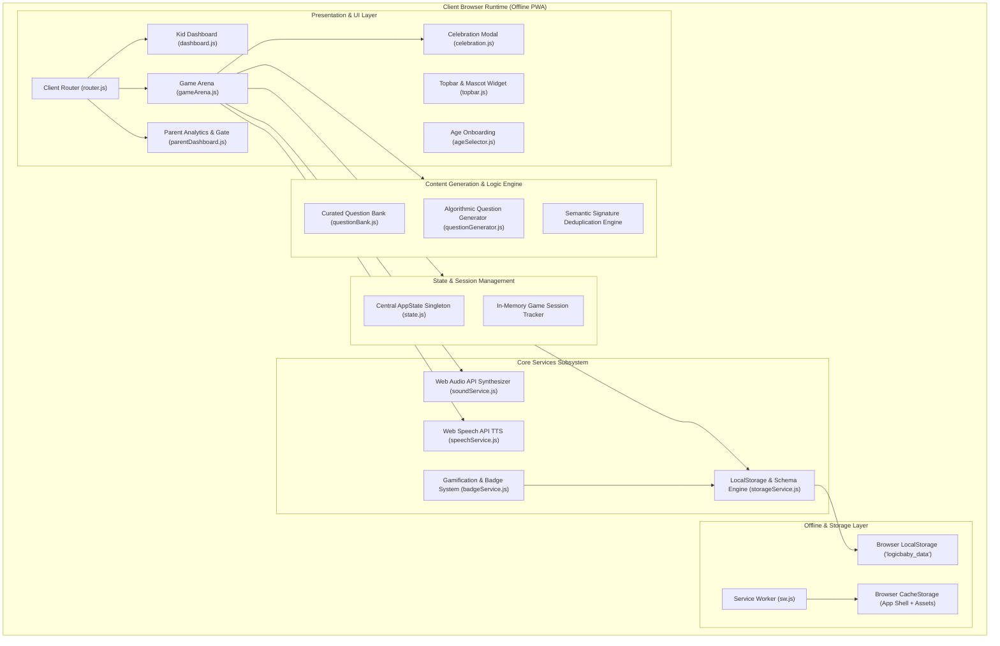
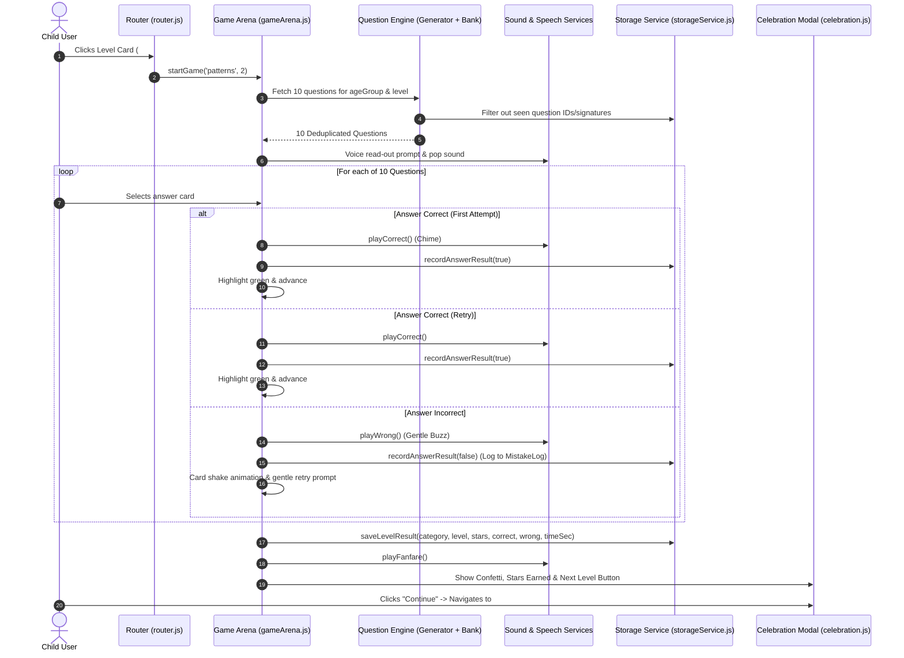
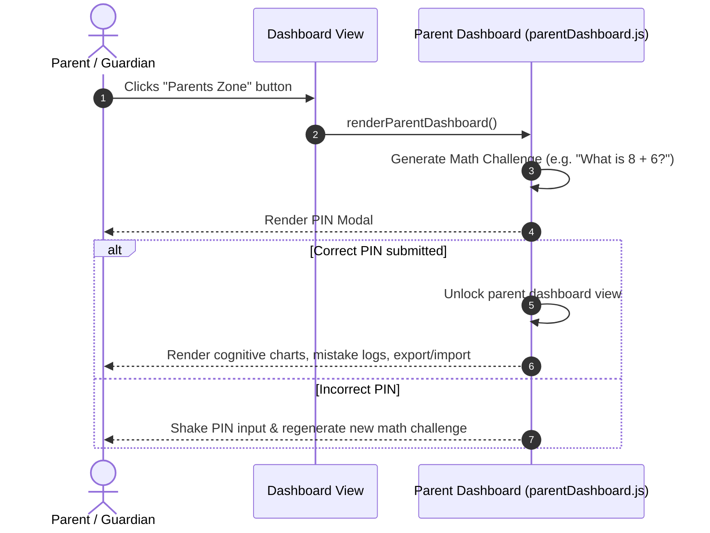
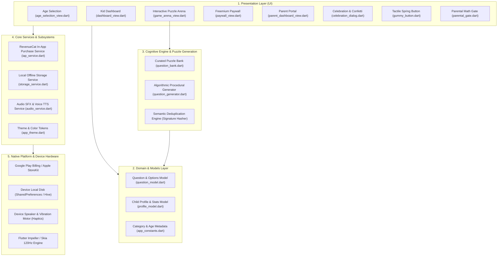

# 🧠 LogicBaby — System Design & Architecture Specification

**Project Name:** LogicBaby  
**Target Audience:** Children (Ages 3–9+) & Parents / Educators  
**Architecture Pattern:** Client-Side Modular Single-Page Application (SPA) / Progressive Web App (PWA)  
**Deployment Model:** 100% Client-Side, Zero External Backend, 100% Offline-First  

---

## 1. Executive Summary & Goals

**LogicBaby** is an interactive, gamified logic puzzle application designed to foster visual and critical reasoning in young children across 4 developmental age groups:
- **Ages 3–4 (Toddlers / Early Preschool):** 🐣 Basic color/shape matching, 2-item sequences, size comparisons.
- **Ages 5–6 (Preschool / Kindergarten):** 🦊 Pattern completion (ABAB, AAB), category sorting, odd-one-out.
- **Ages 7–8 (Early Primary):** 🦁 Spatial rotations, multi-step math logic, grid memory.
- **Ages 9+ (Junior Logic Masters):** 🦅 Complex transformations, multi-attribute sorting, deductive reasoning.

### Key Architectural Requirements:
1. **Zero-Latency & High Responsiveness:** 60fps animations, instant sound synthesis, tactile feedback.
2. **100% Offline Capability:** Operates seamlessly without internet connectivity via Service Worker caching.
3. **Child Safety & Privacy (COPPA Compliant):** No cloud trackers, no ads, no telemetry; all data is strictly stored locally on the device.
4. **Infinite Content & Anti-Repetition:** Dual-engine content pipeline (curated hand-crafted question bank + algorithmic procedural question generator with semantic signature deduplication).
5. **Parental Control & Learning Insights:** Arithmetic-gated Parent Dashboard with detailed cognitive category progress, mistake logging, and data backup/restore.

---

## 2. High-Level System Architecture

LogicBaby follows a **Modular Layered Architecture** structured around ES Modules without heavy third-party framework overhead:



---

## 3. Detailed Component Breakdown

```
logicbaby/
├── index.html                   # Single HTML entry point with PWA meta & app shell
├── manifest.json                # PWA web app manifest (icons, standalone display, theme)
├── sw.js                        # Service Worker implementing cache-first offline strategy
├── server.mjs                   # Lightweight static HTTP server with proper MIME types
├── generate-icons.mjs           # Automated script for generation of PWA icons
├── css/
│   └── main.css                 # Comprehensive CSS design system (tokens, glassmorphism, animations)
├── js/
│   ├── app.js                   # Application bootstrap, routing registration & event listeners
│   ├── router.js                # Hash-based client router with URL parameter extraction
│   ├── state.js                 # Centralized state singleton & active game session manager
│   ├── data/
│   │   ├── questionBank.js      # Curated static puzzle repository across all 6 categories
│   │   └── questionGenerator.js # Procedural dynamic question generator with signature seeds
│   ├── services/
│   │   ├── storageService.js    # LocalStorage persistence, profile CRUD, seen-history, import/export
│   │   ├── soundService.js      # Web Audio API real-time tone & arpeggio synthesizer
│   │   ├── speechService.js     # Web Speech API TTS voice narration engine
│   │   └── badgeService.js      # Achievement milestone evaluator & reward tracking
│   └── views/
│       ├── topbar.js            # Universal topbar with audio toggles, star counts, profile info
│       ├── ageSelector.js       # First-time onboarding & developmental bracket selector
│       ├── dashboard.js         # Category grid, level selectors, streak widget, review launcher
│       ├── gameArena.js         # Interactive game canvas, multi-choice cards, feedback animations
│       ├── celebration.js       # Star rewards, confetti launcher & level completion modal
│       └── parentDashboard.js   # Parental arithmetic PIN lock, cognitive radar charts, mistake log
```

### 3.1. Routing & Lifecycle (`js/app.js`, `js/router.js`)
* **Hash Routing:** The app uses hash changes (`window.onhashchange`) to switch views without reloading the page.
* **Routes:**
  * `#/dashboard` — Main kid hub with category tiles, level progress, and badges.
  * `#/game/:category` / `#/game/:category/:level` — Active puzzle arena for a selected topic and level.
  * `#/parent` — Parental control portal protected by a math PIN gate.
* **View Lazy Loading:** Views are loaded on demand via ES dynamic `import()` to minimize initial parse time.

### 3.2. State Management (`js/state.js`)
* Centralized reactive state singleton containing:
  * `currentProfile`: Current active child's profile object.
  * `currentView`: Name of the active screen.
  * `soundEnabled` & `voiceEnabled`: Audio preferences.
  * `gameSession`: Transient state storing questions in current batch, attempt count per question, reaction times, and accumulated score before persistent write.

### 3.3. Content Generation & Anti-Repetition Engine (`js/data/`)
* **6 Cognitive Logic Categories:**
  1. 🧩 `patterns` — AB, AAB, ABC, progressive number/size sequences.
  2. 🎯 `oddOneOut` — Attribute isolation (living vs. non-living, colors, geometry, purpose).
  3. 📐 `spatial` — Rotations, silhouette matching, shape construction, symmetry.
  4. 🔢 `math` — Visual counting, domino additions, comparative quantities.
  5. 📋 `sorting` — Set classification, grouping by attributes, size ranking.
  6. 🧠 `memory` — Matrix position recall, disappearance detection, flash retention.
* **Procedural Generator:** Generates mathematical and visual logic puzzles on-the-fly.
* **Semantic Deduplication:** Puzzles generate unique semantic signatures (e.g., `pat_abc_star_circle_triangle_v1`). Checked against `profile.seenQuestionSignatures` to guarantee fresh questions every session.

### 3.4. Services Subsystem (`js/services/`)
* **Baby & Early Learner Spring Physics & Animations:**
  * **Squishy Gummy Physics:** Springy cubic-bezier curves (`cubic-bezier(0.34, 1.56, 0.64, 1)`) with cheerful overshoots on card entry (`babyBounceIn`, `cardPopIn`).
  * **Joyful Jelly Answer Reactions:** `jellyBounce` squash & stretch upon solving puzzles, accompanied by rainbow celebratory bursts (`✨`, `⭐`, `🌟`, `🐣`, `🎈`, `💖`, `🍭`, `🧸`, `🌈`, `🚀`).
  * **Gentle Encouraging Wobble:** `friendlyWobble` soft cuddly jiggle on incorrect retries to eliminate frustration.
  * **Floating Breathing Mascot:** Continuous floating baby bobbing (`float`) with rotational tilts and giggle dances on victory (`mascotCheer`).
  * **Staggered Star Boings:** `starPop` rotational popping for trophy and level completion stars.
* **Web Audio Sound Synthesizer (`soundService.js`):**
  * Synthesizes waveforms (sine, triangle, square) using oscillators and gain envelopes.
  * Zero external sound files needed.
  * Audio actions: `pop`, `click`, `correct` (major triad chime), `wrong` (gentle buzz), `fanfare` (victory arpeggio), `streak` (ascension tones).
* **Text-to-Speech Voice Narration (`speechService.js`):**
  * Auto-detects system voices and selects child-friendly, natural voices.
  * Reads puzzle questions and answer options on interaction.
* **Gamification & Badges (`badgeService.js`):**
  * Computes 12+ achievement milestones (e.g., *First Step, Star Collector, Daily Spark, Shape Wizard, Logic Legend*).

---

## 4. Data Models & Local Storage Schema

All application data is serialized as JSON in `localStorage` under the key `logicbaby_data`.

```json
{
  "version": 1,
  "activeProfileId": "profile-1771490000000",
  "profiles": {
    "profile-1771490000000": {
      "id": "profile-1771490000000",
      "name": "Leo",
      "ageGroup": "5-6",
      "avatar": "🦊",
      "createdAt": "2026-08-19",
      "stats": {
        "totalAnswered": 42,
        "totalCorrect": 38,
        "totalWrong": 4,
        "totalStars": 36,
        "currentStreak": 3,
        "lastPlayedDate": "2026-08-19",
        "totalTimeSec": 620
      },
      "categoryStats": {
        "patterns":  { "answered": 10, "correct": 10, "stars": 9, "levelsCompleted": 3 },
        "oddOneOut": { "answered": 8,  "correct": 7,  "stars": 6, "levelsCompleted": 2 },
        "spatial":   { "answered": 8,  "correct": 7,  "stars": 6, "levelsCompleted": 2 },
        "math":      { "answered": 6,  "correct": 5,  "stars": 6, "levelsCompleted": 2 },
        "sorting":   { "answered": 5,  "correct": 5,  "stars": 6, "levelsCompleted": 2 },
        "memory":    { "answered": 5,  "correct": 4,  "stars": 3, "levelsCompleted": 1 }
      },
      "levelProgress": {
        "patterns": {
          "currentLevel": 4,
          "levelStars": { "1": 3, "2": 3, "3": 3 }
        }
      },
      "mistakeLog": [
        {
          "questionId": "pat-gen-102",
          "wrongOptionId": "opt-2",
          "category": "patterns",
          "timestamp": "2026-08-19T10:15:00.000Z"
        }
      ],
      "sessionHistory": [
        {
          "category": "patterns",
          "level": 3,
          "date": "2026-08-19",
          "correct": 10,
          "wrong": 0,
          "stars": 3,
          "timeSec": 95
        }
      ],
      "seenQuestionIds": ["pat-1", "pat-2"],
      "seenQuestionSignatures": ["pat_ab_circle_square_v1"],
      "preferredDifficulty": 1
    }
  }
}
```

---

## 5. Sequence Flows & Logic Lifecycles

### 5.1. Game Level Lifecycle


### 5.2. Parental Gate Flow


---

## 6. Offline Strategy & PWA Implementation

* **Cache-First Caching (`sw.js`):**
  * Pre-caches core App Shell (`index.html`, `css/main.css`, all `js/**/*.js`, `manifest.json`, icon assets).
  * On network requests, serves immediately from local browser cache, falling back to network if unavailable.
* **PWA Web App Manifest (`manifest.json`):**
  * `display: standalone` removes browser navigation bars on mobile and tablet.
  * Theme color `#6C3FB5` coordinates with mobile system status bars.
  * Maskable icons enable native-like installation on Android, iOS, Windows, macOS, and ChromeOS.

---

## 7. Privacy, Security & Child Safety

1. **COPPA / GDPR-K Compliance:**
   * LogicBaby requires no account creation, email, or personally identifiable information (PII).
   * 100% of data stays inside the user's device (`localStorage`).
2. **Zero Third-Party Trackers:** No analytics SDKs, advertising libraries, or telemetry.
3. **Parental Math Gate:** Prevents children from accidentally resetting progress, modifying difficulty, or importing/exporting data.

---

## 8. Verification & Test Suite

The repository includes standalone validation tools:
* `test-runner.mjs`: Automated command-line test runner verifying question generation across all categories and age brackets.
* `test-questionbank.html`: Visual test suite in the browser to inspect question rendering, option counts, answer keys, and voice narration triggers.

---

## 9. Mobile Native Architecture (Flutter / App Stores)

For production deployment on **Google Play Store** and **Apple App Store**, the project provides a **5-Layered Flutter Native Architecture** in [`logicbaby_mobile/`](file:///c:/logicbaby/logicbaby_mobile):



### Key Native Mobile Highlights:
1. **RevenueCat In-App Purchase Paywall (`paywall_view.dart`)**:
   - Free Tier: Levels 1–3 in each category are 100% free.
   - Paid Tier: Unlocks infinite procedural levels, all 6 categories, and all age tiers (Monthly \$3.99/mo or Lifetime \$9.99).
2. **COPPA Parental Gate (`parental_gate.dart`)**: Dynamic arithmetic challenge prevents accidental kid purchases.
3. **100% Offline Multi-Child Persistence (`storage_service.dart`)**: Instant loading with zero cloud tracking.
4. **Bouncy Tactile Physics (`gummy_button.dart`)**: Smooth 60–120 FPS spring animations tailored for toddlers and early learners.
