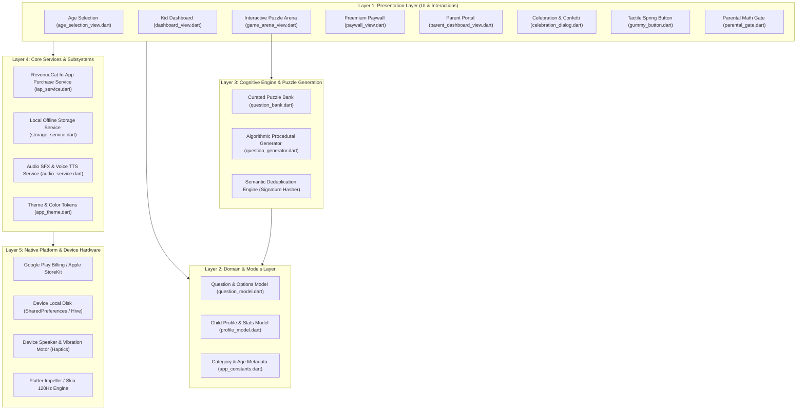

# 📱 LogicBaby Mobile Native (Flutter)

Full Native Cross-Platform Mobile Application for **Google Play Store** and **Apple App Store** featuring **RevenueCat In-App Purchases (Freemium Paywall)**, **COPPA Parental PIN Gate**, and **100% Offline Cognitive Puzzle Engine**.

---

## 🏛️ 5-Layered Mobile Architecture Specification



---

## 🔍 Detailed Layer Breakdown

### 🎨 Layer 1: Presentation Layer (`lib/presentation/`)
- **`views/age_selection_view.dart`**: Onboarding screen for selecting child developmental tiers (3–4, 5–6, 7–8, 9+) and avatars (`🐣 🦊 🦁 🦅`).
- **`views/dashboard_view.dart`**: Kid hub displaying 6 category cards, star tallies, and level progression tracks.
- **`views/game_arena_view.dart`**: Zero-latency interactive puzzle arena with SVG vector graphics and instant feedback.
- **`views/paywall_view.dart`**: Monetization screen offering Monthly Subscriptions (\$3.99/mo) and Lifetime Pass (\$9.99).
- **`views/parent_dashboard_view.dart`**: Analytical portal displaying cognitive strengths, time spent, and mistake logs.
- **`views/celebration_dialog.dart`**: Level completion modal featuring confetti cannon bursts and star drops.
- **`widgets/gummy_button.dart`**: Tactile rubbery spring button with bouncy physics.
- **`widgets/parental_gate.dart`**: Dynamic math challenge gate (*"What is 8 + 5?"*) protecting settings and IAP.

---

### 📦 Layer 2: Domain & Models Layer (`lib/models/`, `lib/core/constants/`)
- **`question_model.dart`**: Standardized data structure for puzzles, vector graphics, multi-choice options, and explanations.
- **`profile_model.dart`**: Data models for Child Profile, Category-wise progress, daily streaks, and mistake tracking.
- **`app_constants.dart`**: Brand color palettes, category definitions, age tiers, and Free Tier level boundaries (Level 3).

---

### 🧠 Layer 3: Cognitive Puzzle Engine (`lib/data/`)
- **`question_bank.dart`**: Handcrafted cognitive questions tailored to developmental milestones.
- **`question_generator.dart`**: Procedural generation algorithms creating endless patterns, math dominoes, and spatial rotations.
- **Deduplication Engine**: Semantic signature hashing ensuring children never encounter repeat puzzles.

---

### ⚙️ Layer 4: Core Services Subsystem (`lib/core/services/`)
- **`iap_service.dart`**: RevenueCat client managing Google Play Billing, Apple StoreKit, and entitlement verification.
- **`storage_service.dart`**: 100% offline JSON persistence saving progress directly to device storage.
- **`audio_service.dart`**: SoundPool sound effects synthesizer and Text-to-Speech (TTS) narration engine.
- **`app_theme.dart`**: Global design tokens, Fredoka headings, and Nunito typography.

---

### 📱 Layer 5: Native Platform Layer
- **Google Play Billing & Apple StoreKit**: Secure in-app payments and family sharing.
- **Device Storage (`SharedPreferences`)**: Sandboxed on-device local database.
- **Vibration & Haptics**: Tactile physical feedback on touch interactions.
- **Impeller Graphics Engine**: 120 FPS hardware-accelerated vector rendering.

---

## 🔄 Interaction & Execution Flow

```
1. [Touch] ──────────► game_arena_view.dart (Gummy spring tap animation)
                              │
2. [Evaluate] ───────► question_model.dart (Verify selectedOption == correctOption)
                              │
3. [Feedback] ───────► audio_service.dart (Trigger correct chime + Haptic vibration)
                              │
4. [Persist] ────────► storage_service.dart (Save stars, streak & score to disk)
                              │
5. [Monetize] ───────► iap_service.dart (If Level > 3 & free tier -> Trigger Paywall)
```

---

## 🚀 How to Run & Build:

### 1. Run in Debug Mode:
```bash
cd logicbaby_mobile
flutter pub get
flutter run
```

### 2. Build Release Android App Bundle (AAB for Google Play Store):
```bash
flutter build appbundle --release
```
*Output: `build/app/outputs/bundle/release/app-release.aab`*

### 3. Build Release Android APK (For Direct Device Testing):
```bash
flutter build apk --release
```
*Output: `build/app/outputs/flutter-apk/app-release.apk`*

### 4. Build iOS (Xcode Project for Apple App Store):
```bash
flutter build ipa --release
```

---

## 💰 In-App Purchase Setup (RevenueCat):
1. Create a free project at [RevenueCat Dashboard](https://app.revenuecat.com).
2. Connect your Google Play Console Service Account & Apple App Store Connect Shared Secret.
3. Configure Entitlement: `premium_pass` with Products:
   - `monthly_pass` (\$3.99 / month)
   - `lifetime_pass` (\$9.99 one-time)
4. Insert your public API keys in `lib/core/services/iap_service.dart`.
